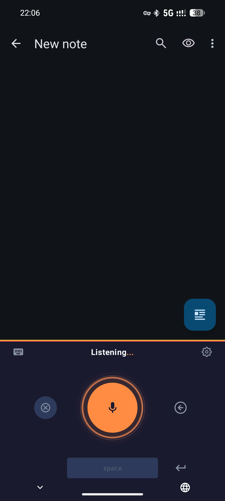
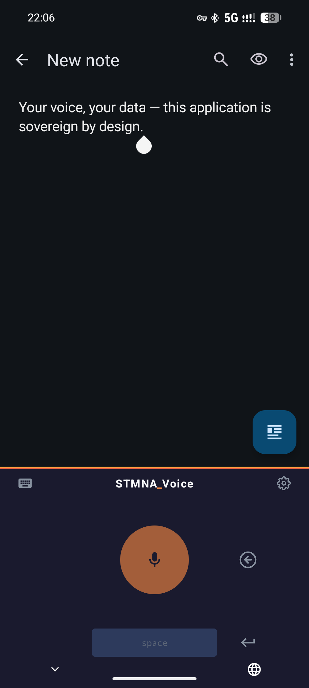
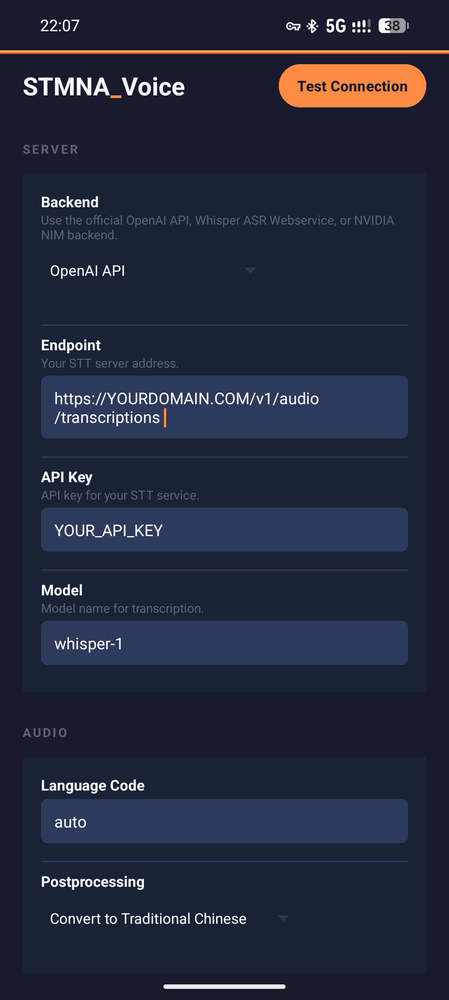

<div align="center">

  

  <br/>

  <h1>STMNA_Voice Mobile</h1>

  <p><em>Sovereign push-to-talk voice input for Android.</em></p>

  [](LICENSE)
  [](https://developer.android.com)
  [](https://kotlinlang.org)
  

  <br/>

  [📱 Install](#install) · [⚙️ Setup](#setup) · [📚 Guides](#-guides) · [🔨 Build from Source](#build-from-source)

</div>

---

## What is STMNA_Voice Mobile?

STMNA_Voice Mobile is an Android app that records your voice and sends audio to your own server for transcription. Tap the mic, speak, and the transcribed text appears at your cursor in any app.

Your audio goes to YOUR hardware, not a cloud API. The phone is a thin client. All speech-to-text inference happens on your [STMNA_Desk](https://github.com/stmna-io/stmna-desk) (or any server running a Whisper-compatible endpoint). Nothing leaves your network unless you want it to.

Supports OpenAI API, Whisper ASR Webservice, and NVIDIA NIM backends.

---

## Features

🎙️ **Tap and Speak** Record audio with one tap, get polished text at your cursor in any app.

🔒 **Your Audio, Your Server** All transcription happens on your own hardware. No cloud APIs.

🧠 **Gets Smarter Over Time** Every transcription builds a personal training dataset for fine-tuning Whisper on your voice.

🔌 **Any Whisper Backend** Works with any OpenAI-compatible, Whisper ASR Webservice, or NVIDIA NIM endpoint.

---

## Screenshots

<div align="center">

| Listening | Transcribed | Settings |
|:---------:|:-----------:|:--------:|
|  |  |  |

</div>

---

## Requirements

| Requirement | Details |
|-------------|---------|
| Android | 7.0+ (API 24) |
| Backend | A running STMNA_Voice server: [stmna-voice](https://github.com/stmna-io/stmna-voice) |
| Network | LAN access or HTTPS via reverse proxy to your server |

---

## Install

### APK Sideload

1. Download `app-release.apk` from the [repo root](app-release.apk) or [Releases](https://github.com/stmna-io/stmna-voice-mobile/releases)
2. On your device, go to **Settings > Apps > Special app access > Install unknown apps** and allow your file manager or browser
3. Open the APK and install
4. Grant microphone permission when prompted

### Play Store

Coming soon.

---

## Setup

1. Open STMNA_Voice from your app drawer
2. Set your **backend type** (OpenAI API, Whisper Webservice, or NVIDIA NIM)
3. Enter your server's **endpoint URL** (e.g. `https://YOURDOMAIN.COM/v1/audio/transcriptions`)
4. Enter your **API key** if required
5. Tap **Test Connection** to verify
6. Go to **Settings > System > Languages & Input > On-screen keyboard** and enable **STMNA_Voice**
7. In any text field, switch to the STMNA_Voice keyboard using the keyboard switcher

Full configuration reference: [App Guide](docs/app-guide.md)

---

## Build from Source

```bash
git clone https://github.com/stmna-io/stmna-voice-mobile
cd stmna-voice-mobile
./gradlew assembleRelease
```

The APK will be at `app/build/outputs/apk/release/app-release.apk`. Install with:

```bash
adb install app/build/outputs/apk/release/app-release.apk
```

See the [Build Guide](docs/build-guide.md) for full instructions including signing configuration.

---

## 📚 Guides

| Guide | What's in it |
|-------|-------------|
| [App Guide](docs/app-guide.md) | Full setup, configuration reference, troubleshooting |
| [Build Guide](docs/build-guide.md) | Build from source with Android Studio |

---

## 🔗 Ecosystem

| Product | Description | Repo |
|---------|-------------|------|
| **STMNA_Desk** | Self-hosted AI inference stack (reference architecture for AMD hardware) | [stmna-desk](https://github.com/stmna-io/stmna-desk) |
| **STMNA_Signal** | Content ingestion + AI processing pipeline (YouTube, web, ebooks, voice notes) | [stmna-signal](https://github.com/stmna-io/stmna-signal) |
| **STMNA_Voice** | Self-improving push-to-talk speech-to-text pipeline | [stmna-voice](https://github.com/stmna-io/stmna-voice) |

---

## Acknowledgments

- [Whisper-to-Input](https://github.com/j3soon/whisper-to-input) by Yan-Bin Diau, Johnson Sun, and Ying-Chou Sun (the upstream fork)
- [FUTO Voice Input](https://voiceinput.futo.org/) (recommended offline fallback for when you're away from your server)

---

## Contributing

Contributions welcome. See [CONTRIBUTING.md](CONTRIBUTING.md) for guidelines.

Areas where help is especially valued:
- Accessibility improvements
- Language and locale testing
- Bug reports with device model and Android version
- Kotlin/Compose UI improvements

For pipeline or backend contributions, head to the [stmna-voice](https://github.com/stmna-io/stmna-voice) repo.

---

## License

GPLv3. See [LICENSE](LICENSE) for the full text.

This project is a fork of [Whisper-to-Input](https://github.com/j3soon/whisper-to-input). Under GPLv3, you are free to use, modify, and distribute this software, provided that derivative works are also released under GPLv3.

---

<div align="center">
  <sub>Built by <a href="https://github.com/stmna-io">STMNA_</a> · Engineered resilience. Sovereign by design.</sub>
</div>
